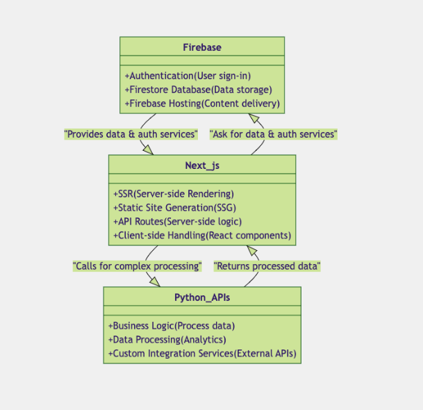

# Project Title: Fullstack Development Challenge

## Introduction
This document outlines the high-level architecture and detailed system components for a fullstack development project using Google Firebase, Next.js (TypeScript), and Python microservices. It also includes a comprehensive migration strategy from an existing Bubble setup to the proposed new architecture.

## System Architecture Overview

### 1. Google Firebase
Firebase serves as the backend-as-a-service (BaaS) platform, providing essential services like:
- **Authentication**: Manages user authentication and authorization.
- **Firestore Database**: Handles data storage and retrieval.
- **Firebase Hosting**: Provides hosting for static assets and the Next.js application.

### 2. Next.js (TypeScript)
Next.js acts as the frontend framework, enhancing the application with:
- Server-side rendering capabilities.
- Efficient routing and page rendering based on backend data.

### 3. Python (Microservices/APIs)
Python is utilized for developing microservices or APIs that handle business logic not covered by Firebase:
- **Humanizer APIs**: Custom Python services for complex data processing or systems integration.

## Detailed Component Roles

### Firebase
- **Authentication**: Uses Firebase Authentication for managing user sign-in, sign-up, and sessions.
- **Firestore Database**: Real-time data storage and syncing, ideal for user profiles, preferences, and dynamic data.
- **Firebase Hosting**: Hosts Next.js built assets, serving them over a Content Delivery Network (CDN).

### Next.js (TypeScript)
- **TypeScript**: Leverages strong typing to reduce runtime errors.
- **Integration**: Authenticates users and fetches data directly from Firebase Firestore.
- **Server-Side Rendering**: Enhances performance for faster page loads and better SEO.

### Python
- **Microservices**: Implements backends in Python to manage data processing, analytics, and server-side logic.
- **API Communication**: Next.js application can call Python APIs to retrieve processed data or perform server-side operations.

## Integration Strategies

- **Next.js and Firebase**: Utilize Firebase SDK within Next.js to directly interact with Firebase services like authentication and Firestore.
- **Next.js and Python APIs**: Employ standard HTTP requests or libraries like Axios in Next.js for communication with Python-based APIs.

## Migration Strategy Outline

### Pre-Migration Preparation

- **SEO and Downtime Considerations**: Maintain existing system while setting up alternative flow. Set up Firebase and Next.js infrastructure parallel to the existing Bubble setup for seamless testing.
- **Data Assessment**: Evaluate the current data schema in Bubble and design an improved schema in Firebase. Identify dependencies and plan for data integrity.
- **Environment Setup**: Configure Firebase project, Firestore Database, Authentication, and Hosting. Initialize Next.js application with proper directory structure and routing.

### Data Migration Plan

- **Data Export from Bubble**: Utilize Bubble's data export feature to extract all existing data, ensuring consistency and compatibility with Firebase.
- **Data Transformation**: Develop Python scripts to transform data to Firestore's required format.
- **Data Import to Firebase**: Conduct a test import to verify data integrity before performing a full batch import.

### Transitioning Business Logic

- **Business Logic Analysis**: Document all workflows and processes currently managed in Bubble.
- **Implementation in JavaScript/TypeScript**: Rewrite critical business logic in JavaScript/TypeScript. Test each logic component in a development environment before production.
- **Iterative Deployment**: Deploy new logic in phases, starting with non-critical systems, to minimize risk. Utilize feature flags and staged rollouts for new features.

### Risk Assessment and Mitigation

- **Risk Identification**: Conduct a thorough risk assessment to identify potential failure points and their impact.
- **Mitigation Strategies**: Develop a comprehensive rollback plan for critical failures. Implement extensive logging and monitoring to address issues promptly.
- **Business Continuity**: Maintain the Bubble environment until the Firebase/Next.js system is fully tested and stable. Communicate migration timelines and changes clearly to customers.

### Post-Migration

- **SEO and Functionality Monitoring**: Monitor SEO rankings and site traffic to ensure no adverse effects from the migration. Utilize Google Search Console for performance tracking.
- **User Feedback and Support**: Provide channels for user feedback on the new system. Offer support and documentation to help users adapt to changes.
- **Phase-Out Bubble**: Gradually phase out the Bubble application once the new system is verified and stable. Keep a backup of the Bubble application for a short period post-migration.

## CI/CD Implementation

1. **Set Up Your GitHub Repository**: Ensure your Next.js app is stored in a GitHub repository to use GitHub Actions for CI/CD.
2. **Configure GitHub Actions**: Create a `.github/workflows` directory and add a YAML file (e.g., `ci-cd.yml`) for your CI/CD pipeline.
3. **Define the CI/CD Workflow**:
    - **Triggers**: Pipeline triggers on every push or pull request to the main branch.
    - **Node.js Setup**: Ensures the correct version of Node.js is installed.
    - **Dependencies**: Installs necessary npm packages.
    - **Testing**: Executes tests to ensure code reliability.
    - **Build and Deploy**: Compiles the Next.js application and deploys to Vercel using GitHub secrets.
4. **Monitor and Optimize**: Keep an eye on the pipeline for failures, and refine processes to optimize build times and deployment.

## UI Library - Ant Design

- **Comprehensive Component Suite**: Offers a wide range of pre-built components like tables, dropdowns, and forms.
- **Customizable Theming**: Supports theming to match project branding, enhancing visual identity across the application.
- **Efficient Development**: Streamlines development by reducing boilerplate code, crucial for rapid iteration in modern web environments.
- **SSR Compatibility**: Fully compatible with Next.js's server-side rendering, improving SEO and page load times.

## Conclusion

This README provides a detailed outline of the migration strategy, system components, and integration methods for transitioning from Bubble to a robust Firebase and Next.js architecture. By following these steps, the project aims to enhance scalability, performance, and maintainability.
